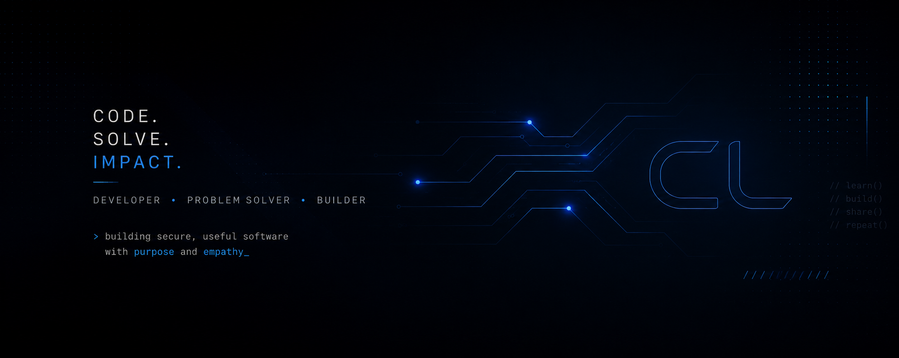
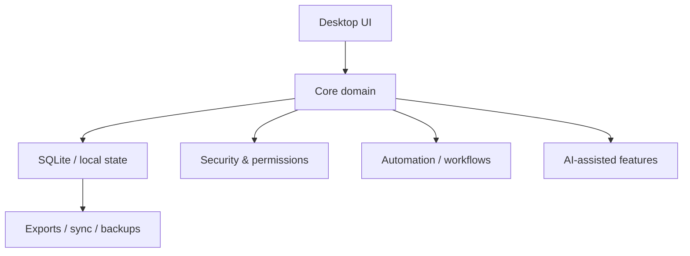

# Carlos Luna

Code. Solve. Impact.

Cybersecurity · AI · Tauri · Rust · TypeScript · SQLite

Developer · Problem solver · Builder

`secure systems, local-first UX, measurable impact.`

---

### Systems profile

I build desktop applications and local-first tools with strong privacy boundaries, observable behavior, and maintainable architecture.

### Core signals

| Signal | Value |
| --- | --- |
| Base | Argentina |
| Domain | Desktop apps, cybersecurity, AI, digital health |
| Stack | Rust, Tauri, React, TypeScript, SQLite |
| Principle | Privacy-first, testable, reproducible |

### Tooling & platforms

  
  
  
  
  
  
  

### Featured work

- Butler Key - security-focused desktop tooling built around local control and low-friction workflows.
- Nodo Blanco - operational automation and structured task flows.
- JUSTA - applied software with a clear systems boundary and maintainable UI.
- LAIKA - focused product work with a privacy-first mindset.

### Now building

- Local-first desktop experiences with explicit permissions
- Repeatable release pipelines and export paths
- Secure UX patterns for multi-session tools
- AI-assisted features that stay bounded and auditable

### Architecture map

### Live stats

  

### Current work

- Desktop application architecture
- Local-first workflows
- Secure UX and permission boundaries
- Reproducible builds and test coverage

### Outside the lab

- Coffee
- Learning systems
- Animals
- Open knowledge
