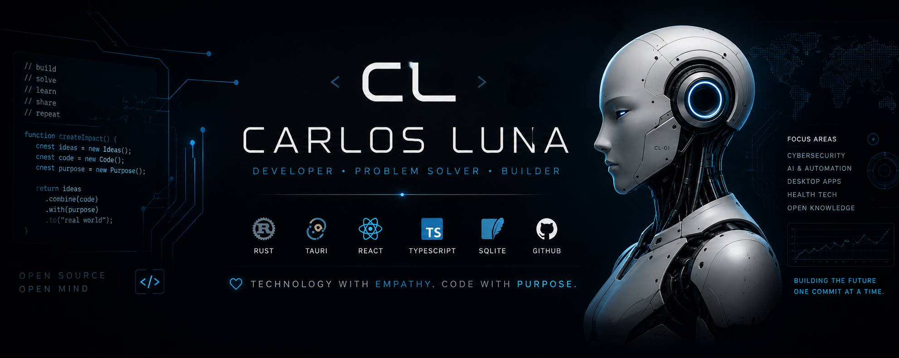

# Carlos Luna

Building secure, useful software.

Cybersecurity · AI · Tauri · Digital Health · Accessibility

❤️ Technology with empathy, code with purpose.

---

### About

I build desktop applications and local-first tools with a focus on privacy, accessibility, and long-term maintainability.

### Quick view

| Field | Details |
| --- | --- |
| Based in | Argentina |
| Focus | Desktop apps, cybersecurity, AI, digital health |
| Approach | Privacy-first, accessible, long-term maintainability |

### Current focus

- Desktop applications
- Local-first architecture
- Security and privacy
- Clear UX

### Outside coding

- Coffee
- Learning
- Animals
- Open knowledge
